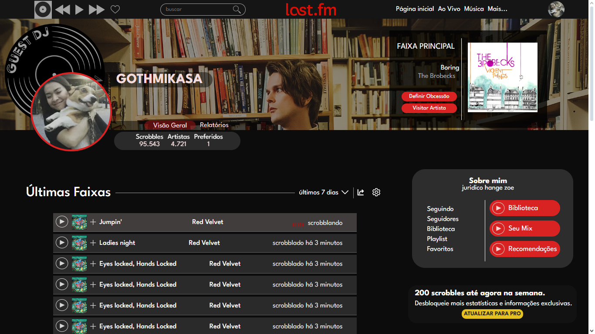
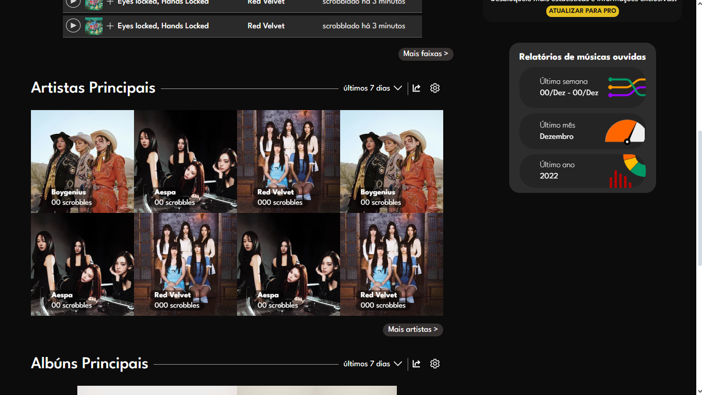
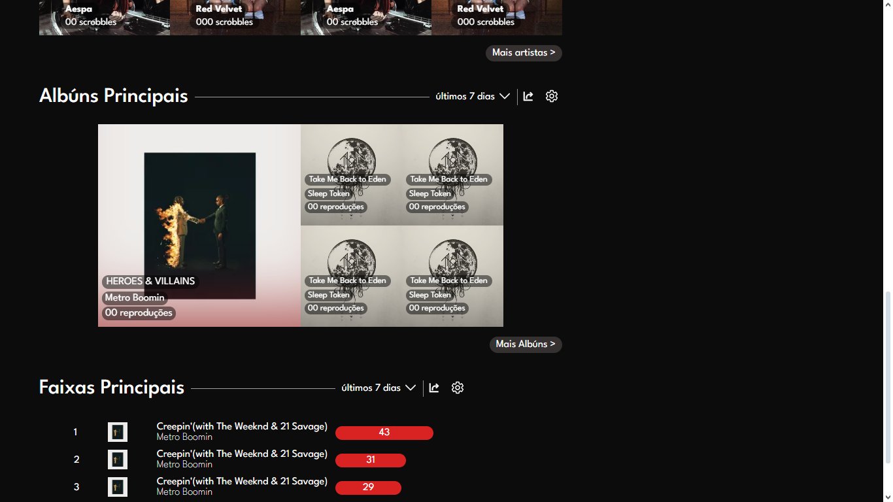
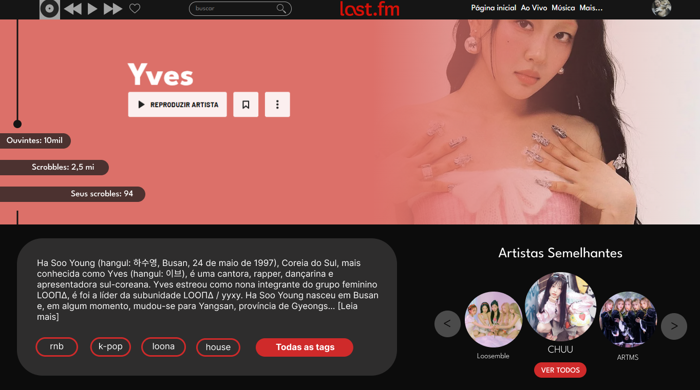
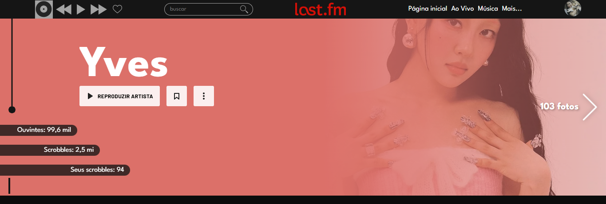

# Remake: LastFm - [🔴Em andamento]
  Olá!! Nesse projeto estou tentando refazer o design do site do last fm que é uma rede que eu utlizo e gosto bastante. O aplicativo móvel tem uma estética inteira montada em cima das cores vermelho e preto, então ao utilizar o site no navegador sempre sinto que essas cores poderiam ser mais exploradas, ou pelo menos que o usuário pudesse ter a escolha de usar um modo noturno e não somente o modo claro.  
  ├── Maior foco: Praticar CSS  
  ├── Principais objetivos: Além de refazer toda a parte gráfica, deixar o site mais acessível, oferecer pro usúario opções de interface escura/clara e também uma mais leve e com menos detalhes gráficos pra navegadores ou caso de rede com internet fraca.  
### ATENÇÃO
Todos os créditos pertencem ao LastFm, esse projeto não tem nenhuma finalidade comercial, apenas pratica e evolução dos meus conhecimentos " :))

# Resumo geral até o momento
  Algumas imagens desse processo:
## Perfil
Original  
  
Remake  
  
  
  
  
[Visite o site oficial do lastFm(Perfill)](https://www.last.fm/pt/user/GOTHMIKASA)
## Página Inicial

Original  
  
Remake  
  
[Visite o site oficial do lastFm(Pagina inicial)](https://www.last.fm/pt/home)

## Artista
Original  
  
Remake  
  
  
[Visite o site oficial do lastFm(Artista)](https://www.last.fm/pt/music/Yves)
